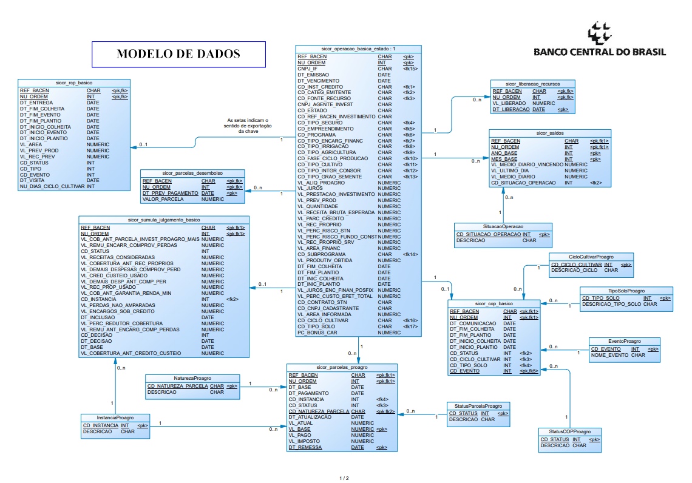
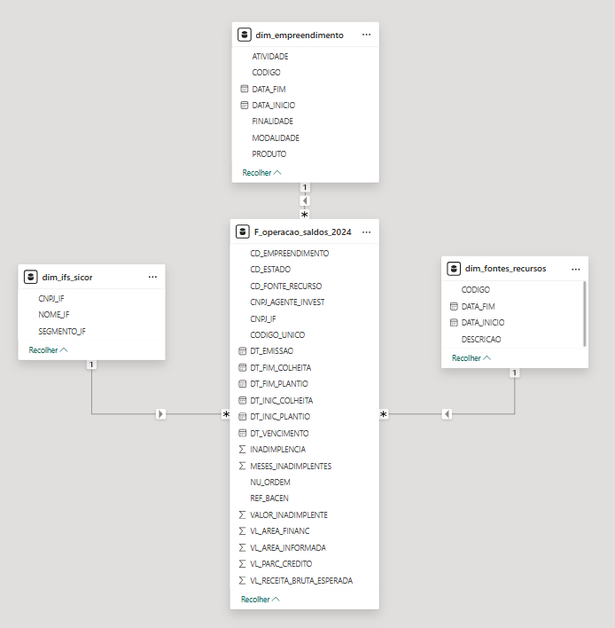
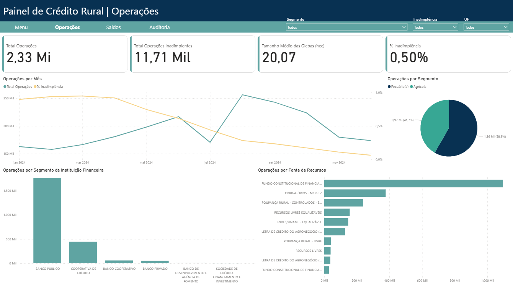
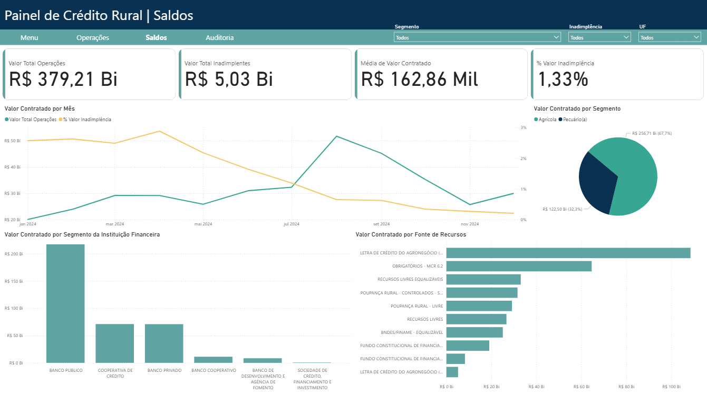
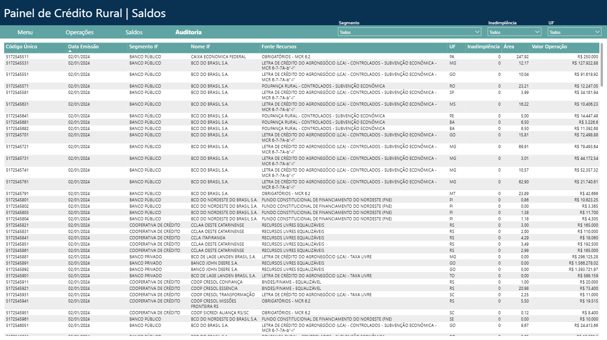

# 📘 Relatório Técnico – Análise Descritiva das Operações de Crédito do SICOR (2024)
**UC Análise de Dados e Big Data – USJT Mooca**  
**Professores:** Thainá Rocha e Juca Rodrigues  
**Ano:** 2025  

---

# Capa
**ANÁLISE DESCRITIVA DAS OPERAÇÕES DE CRÉDITO CONTRATADAS E REGISTRADAS NA BASE SICOR**  
Relatório Final – A3  
Universidade São Judas Tadeu – Campus Mooca  
Curso: Comunicação / Big Data  

---

# Contra-capa
Este relatório apresenta os procedimentos metodológicos, análises e resultados referentes ao projeto de análise descritiva das operações de crédito do Sistema de Informações de Crédito Rural (SICOR), utilizando dados públicos do Banco Central do Brasil.  
O conteúdo é de responsabilidade exclusiva dos autores.

---

# Sumário
1. Introdução  
2. Problema de Partida  
3. Roteiro de Coleta  
4. Dados Coletados  
5. Processo de ETL  
6. Análise de Dados  
7. Visualização dos Dados  
8. Produto Comunicacional  
9. Conclusão  
10. Anexos  

---

# 1. Introdução
O presente relatório documenta o processo completo de análise de dados aplicado às operações de crédito rural registradas no SICOR – base pública disponibilizada pelo Banco Central.  
O trabalho contemplou:

- seleção das bases,  
- coleta e higienização,  
- construção de um pipeline ETL em Python,  
- análise descritiva,  
- visualização no Power BI,  
- elaboração de um produto comunicacional com base nos achados.  

O objetivo central é compreender os padrões das operações contratadas e identificar sinais relevantes de risco, especialmente inadimplência, variações regionais e distribuição dos valores.

---

# 2. Problema de Partida

O presente trabalho tem como objetivo realizar uma **análise descritiva das operações de crédito rural contratadas e registradas no SICOR**, com foco na caracterização dos contratos e de seus saldos ao longo do ano de 2024. A análise busca compreender como essas operações estão distribuídas entre estados, instituições financeiras, modalidades e tipos de empreendimento, além de observar padrões de valor contratado e comportamento dos saldos mensais.

A partir desse objetivo geral, o grupo se propõe a responder questões como:
- Como estão distribuídas as operações contratadas entre os estados brasileiros?
- Quais instituições financeiras concentram maior volume de operações e quais modalidades são mais representativas?
- Como se comportam os saldos mensais dessas operações ao longo do período analisado?

Além dessas perguntas principais, o estudo também inclui **uma análise complementar da inadimplência**, a partir das informações de situação mensal da operação:

- Qual o percentual de operações que apresentaram algum mês de atraso (código de situação 12)?
- Como esse atraso está distribuído entre estados, instituições financeiras e modalidades?

Essa estrutura permite compreender tanto o cenário geral das operações contratadas quanto aspectos específicos relacionados à sua execução ao longo do tempo.

---

# 3. Roteiro de Coleta
Foram utilizadas bases públicas disponibilizadas pelo Banco Central (BCB).

## Bases coletadas
- SICOR_OPERACAO_BASICA_ESTADO_2024.gz  
- SICOR_SALDOS_2024.gz  
- Tabelas de domínio: Fonte de Recursos, Empreendimento, Instituições Financeiras  

## Ferramentas utilizadas
- Python (Pandas)  
- Leitura direta por URL  
- Arquivos `.gz` usando `latin1` e `;` como separador  

---

# 4. Dados Coletados

## 4.1. Dados das Operações
- Identificação (REF_BACEN, NU_ORDEM, CNPJ_IF)  
- Datas (emissão, vencimento, plantio e colheita)  
- Valores contratados (VL_PARC_CREDITO, VL_RECEITA_BRUTA_ESPERADA)  
- Finalidade e empreendimento  
- Código do estado  

## 4.2. Dados de Saldos
- Valor médio diário  
- Situação da operação (CD_SITUACAO_OPERACAO)  
- Identificação dos meses de inadimplência  

A junção entre ambas resultou na base principal consolidada para análise.

Além dessas informações, também foram coletados dados de empreendimentos, instituições financeiras e fontes de recuros para aprofundar o estudo.

---

# 5. Processo de ETL (Extract, Transform, Load)

O pipeline está implementado no arquivo `etl.py`.

## 5.1. Extração
- Leitura das bases SICOR diretamente via URL  
- Leitura das tabelas de domínio auxiliares  

## 5.2. Transformação

Principais tratamentos realizados:
- Remoção do caractere `#` nos nomes de coluna  
- Padronização de campos monetários:
  - remoção de separador de milhar,  
  - troca de vírgula por ponto,  
  - conversão para `float`  
- Criação da chave única `CODIGO_UNICO = REF_BACEN + NU_ORDEM`  
- Agregação dos saldos por operação

## 5.3. Cálculo dos Indicadores de Inadimplência
A partir da agregação:
- `MESES_INADIMPLENTES`: contagem de meses com status 12  
- `INADIMPLENCIA`: flag binária (>=1 mês)  
- `VALOR_INADIMPLENTE`: soma dos valores médios dos meses inadimplentes  

## 5.4. Carga
Arquivos finais:
- `F_operacao_saldos_2024.parquet`
- `dim_fontes_recursos.parquet`
- `dim_ifs_sicor.parquet`
- `dim_empreendimento.parquet`
Importados para o Power BI.

---

# 6. Modelagem de Dados

## 6.1. Modelagem Inicial

## 6.2. Modelagem Final

# 7. Análise de Dados

## 7.1. Volume e Distribuição
- Estados com maior volume de contratação  
- Comparação dos valores médios por UF  
- Distribuição por tipo de empreendimento  

## 7.2. Inadimplência
Utilizando o critério `CD_SITUACAO_OPERACAO = 12`:
- Taxa geral de inadimplência  
- Número médio de meses inadimplentes  
- Ranking das IFs por valor inadimplente  
- Comparação entre valores contratados e atraso

## 7.3. Correlações
- Valor contratado × meses inadimplentes  
- Estado × percentual de inadimplência  
- Análise de modalidades com maior risco  

---

# 8. Visualização dos Dados (Power BI)

## Página 1 – Visão Operação

# Descrição das Abas do Dashboard

## 1. Menu
Tela inicial do relatório.  
Contém uma breve descrição do painel, link para a documentação e possui botões de navegação para as demais páginas:
- **Operações**
- **Saldos**
- **Auditoria**
---

## 2. Operações
Apresenta a visão geral das operações contratadas.  

---

## 3. Saldos
Mostra uma análise sobre o saldo das operações contratadas.

## 4. Auditoria
Possível visualizar as operações únicas de maneira analítica.

# 9. Produto Comunicacional

## Proposta: Reportagem Multimídia + Dashboard Interativo

### Componentes do Produto Comunicacional
- **Dashboard Power BI:** Disponibilizado via link ou embutido em página web, permitindo interação com filtros de estado, instituição financeira, modalidade e valor contratado.
- **Apresentação do Painel:** Apresentação com a síntese dos insights, gráficos e recomendações estratégicas para interessados no tópico de crédito rural.

### Objetivo
Transformar dados técnicos em informação clara, visual e acessível para:
- tomada de decisão,
- comunicação institucional,
- compreensão pública dos padrões de crédito rural.

### Público-alvo
- Gestores de risco e analistas de crédito  
- Instituições financeiras  
- Agências reguladoras  
- Acadêmicos e estudantes  
- Jornalistas de economia e agronegócio  

---

# 10. Conclusão

A análise descritiva baseada nos dados do SICOR permitiu identificar tendências relevantes nas operações de crédito rural, destacando padrões de inadimplência e variações regionais significativas.

O processo ETL assegurou consistência e qualidade ao conjunto de dados; as visualizações no Power BI tornaram os resultados intuitivos; e o produto comunicacional proposto amplia o impacto e utilidade prática do estudo.

O trabalho atende aos objetivos da UC de Análise de Dados e Big Data, demonstrando domínio das etapas essenciais do ciclo analítico:
- coleta,  
- tratamento,  
- análise,  
- visualização,  
- e comunicação dos resultados.  

---

# 11. Anexos

### Fontes Oficiais da Base SICOR
- **Fonte principal dos dados (BCB – Tabelas de Crédito Rural / Proagro):**  
  https://www.bcb.gov.br/estabilidadefinanceira/tabelas-credito-rural-proagro  

- **Dicionário de Dados SICOR – Versão 7 (Manual Oficial):**  
  https://www.bcb.gov.br/htms/sicor/manualDadosSicor_V7.pdf  

